<!-- START doctoc generated TOC please keep comment here to allow auto update -->
<!-- DON'T EDIT THIS SECTION, INSTEAD RE-RUN doctoc TO UPDATE -->
# [**Table of Contents**](#table-of-table)

- [1. Overview Architect](#1-overview-architect)
- [2. Local setup](#2-local-setup)
- [3. CURL command for REST API](#3-curl-command-for-rest-api)
- [4. Run `Jest` test](#4-run-jest-test)
- [5. Source structure](#5-source-structure)
  - [5.1. Run eslint in every service folder](#51-run-eslint-in-every-service-folder)
  - [5.2. Structure](#52-structure)
  - [5.3. Library Usage](#53-library-usage)
  - [5.4. Database](#54-database)
- [6. Sequence diagram in some use cases](#6-sequence-diagram-in-some-use-cases)

<!-- END doctoc generated TOC please keep comment here to allow auto update -->

# 1. Overview Architect

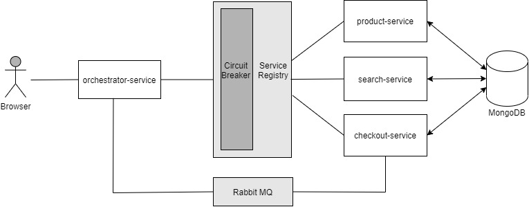
- **orchestrator-service**: It gathers all APIs from others `product-service`, `search-service`, `checkout-service`. It will be mainly used as endpoints for users or frontend services. This service is also a producer to receive mesage and send checkout data message to Message MQ. The `checkout-service` as consumer, it will read messages from Rabbit MQ, they are persisted into MongoDB.
- **search-service**: It provides search and sort functionality for products.
- **product-service**: Service relates to add and delete products.
- **checkout-service**: It is relevant to payment and checkout.
- **service-registry**: It is central service and help to keep track of other services such as register or unregister once we start or stop service.

<br/>
<div align="left">
    <b><a href="#top">⬆️ Back to Top</a></b>
</div>
<br/>

# 2. Local setup
- Start `MongoDB` docker-compose
```shell
cd etc/mongo-docker/
# Create and start containers
docker-compose up -d --build

# Display services
docker-compose ps

# Stop services
docker-compose stop

# Start services
docker-compose start

# Stop and remove containers, networks, images, and volumes
docker-compose down -v
```

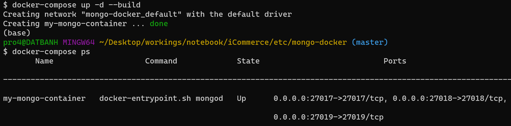

- Use `Robo 3T` to accesss MongoDB with defaut db name and account
```json
db.createUser(
{
	user: "admin",
	pwd: "admin",
	roles: [
		{
			role: "readWrite",
			db: "my-mongo-db"
		}
	]
}
)
```

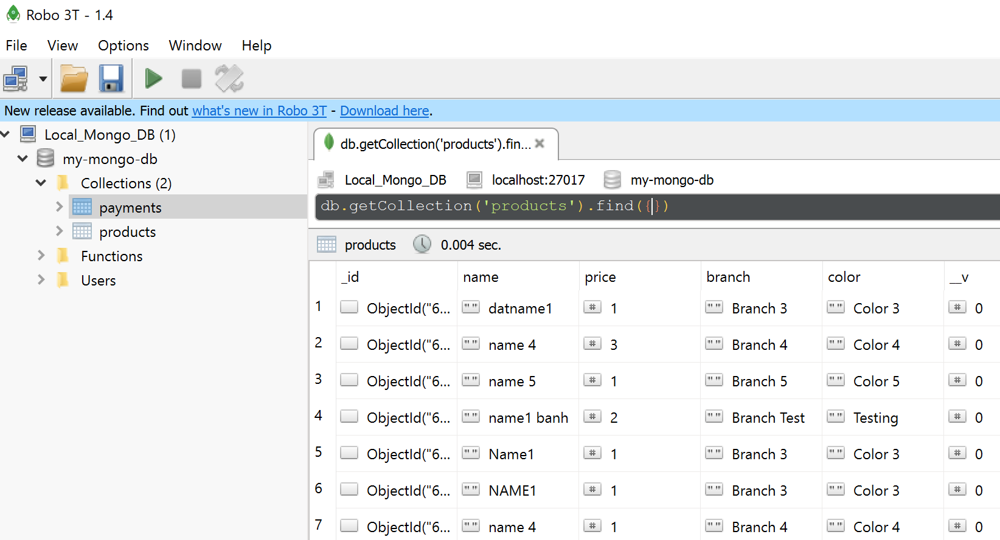


- Start `RabbitMQ` docker
```shell
docker run -it --rm --name rabbitmq -p 5672:5672 -p 15672:15672 rabbitmq:3-management
```
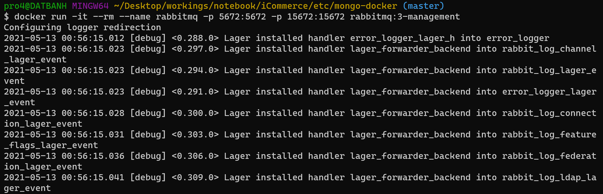

- Start `service-registry`
```shell
cd service-registry
npm run start
```

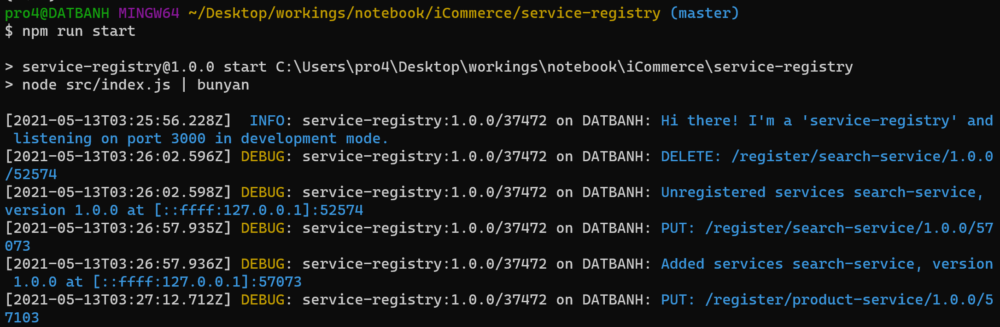


- Start `search-service`
```shell
cd search-service
npm run start
```

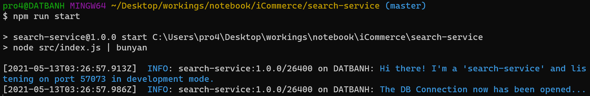


- Start `product-service`
```shell
cd product-service
npm run start
```

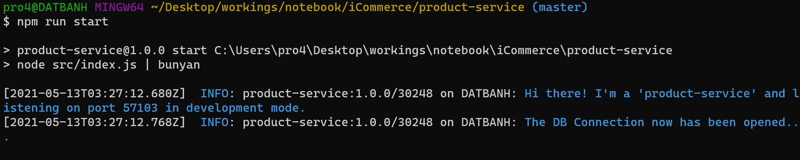


- Start `checkout-service`
```shell
cd checkout-service
npm run start
```
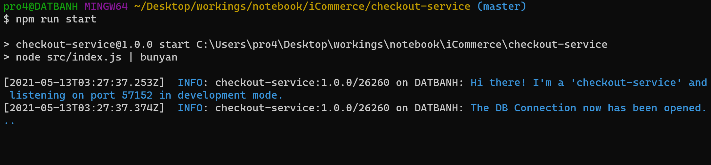


- Start `orchestrator-service`
```shell
cd orchestrator-service
npm run start
```


<br/>
<div align="left">
    <b><a href="#top">⬆️ Back to Top</a></b>
</div>
<br/>

# 3. CURL command for REST API
- Insert products into `Product` table
```shell
curl -X POST --header "Content-Type: application/json" --header "Accept: application/json" -d @etc/product_insert.json "http://localhost:3080/products"
```

- List all products
```shell
curl -X GET --header 'Accept: application/json' 'http://localhost:3080/products' | jq .
```
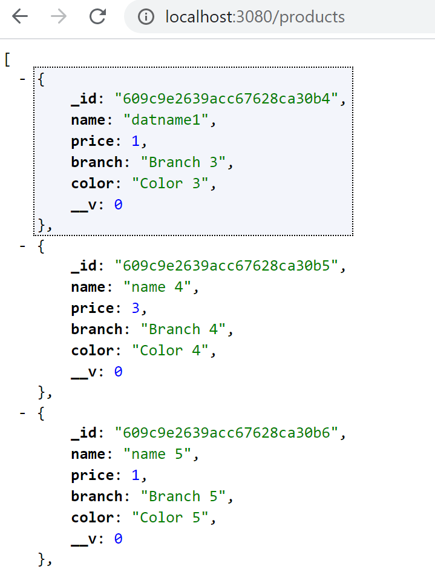

- Search products by name
```shell
curl -X GET --header 'Accept: application/json' 'http://localhost:3080/products?name=name1&sort_by=name' | jq .
```
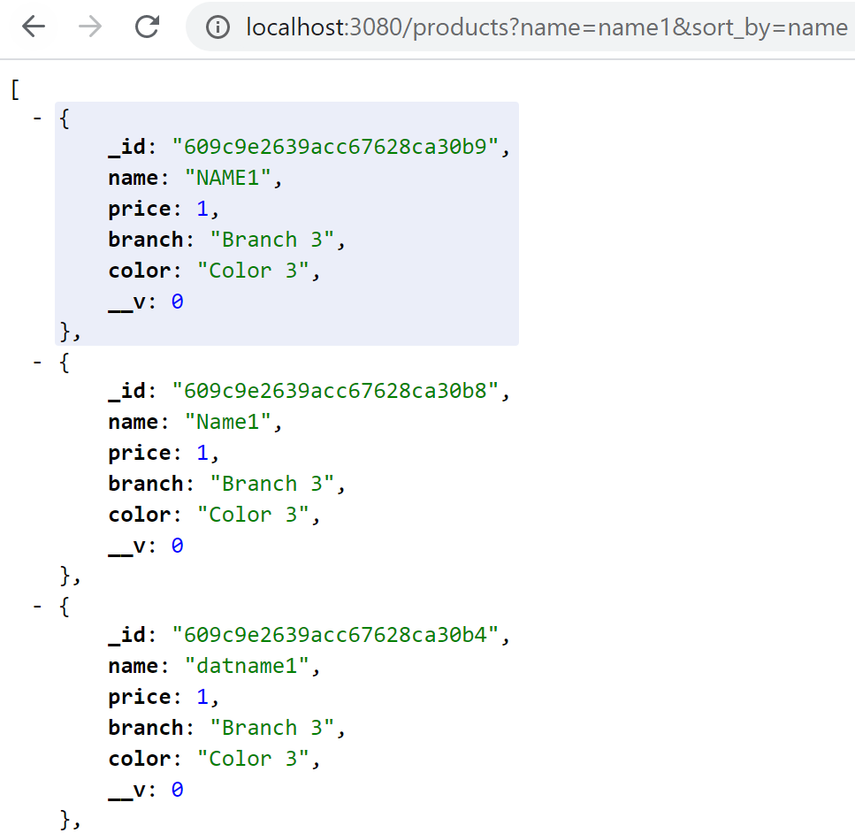

- Search products by name with operator
```shell
curl -X GET --header 'Accept: application/json' 'http://localhost:3080/products?name=eq:name1' | jq .

[
  {
    "_id": "609de68be9d8da4a94453107",
    "name": "name1",
    "price": 2,
    "branch": "Branch Test",
    "color": "Testing",
    "__v": 0
  }
]
```
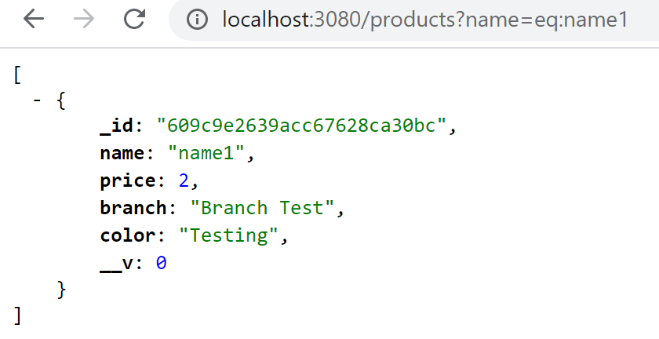

- Search products by name with operator and sort by price on ascending order
```shell
curl -X GET --header 'Accept: application/json' 'http://localhost:3080/products?price=gt:1&sort_by=-price' | jq .
```
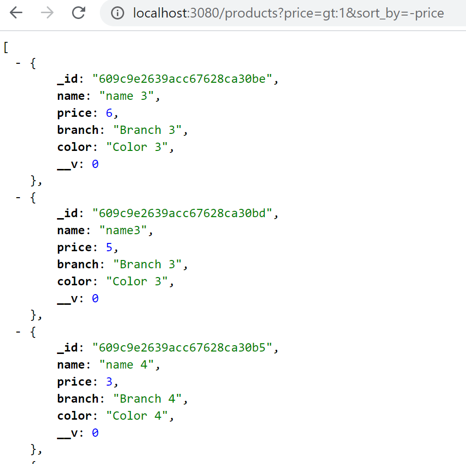

- Delete products
```shell
curl -X DELETE --header "Content-Type: application/json" --header "Accept: application/json" -d @etc/product_delete.json "http://localhost:3080/products"  | jq .
```

- Send data checkout to Message MQ, data will be populated and upserted into `Payments` table
```shell
curl -X POST --header "Content-Type: application/json" --header "Accept: application/json" -d @etc/checkout_send.json "http://localhost:3080/checkout" | jq .
```
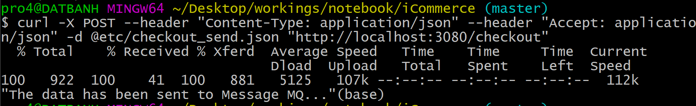


- Search all payments
```shell
curl -X GET --header 'Accept: application/json' 'http://localhost:3080/payments' | jq .
```
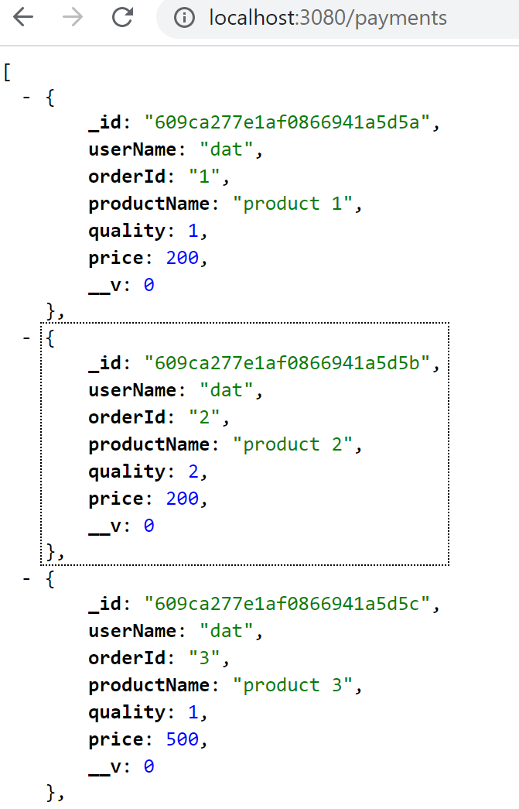

- Search payments by product name
```shell
curl -X GET --header 'Accept: application/json' 'http://localhost:3080/payments?productName=eq:product%203' | jq .

[
  {
    "_id": "609de7b6f3255553dc410746",
    "userName": "dat",
    "orderId": 3,
    "productName": "product 3",
    "quality": 1,
    "price": 500,
    "__v": 0
  }
]
```
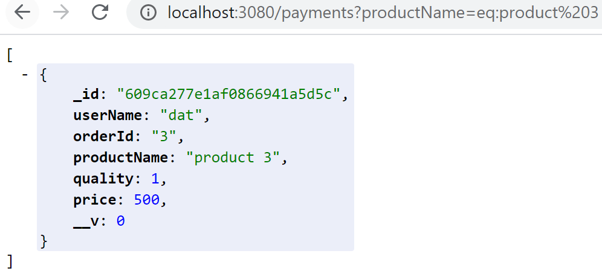

- Search payments by product name and sort price on ascending order
```shell
curl -X GET --header 'Accept: application/json' 'http://localhost:3080/payments?productName=5&sort_by=-price,orderId' | jq .
```

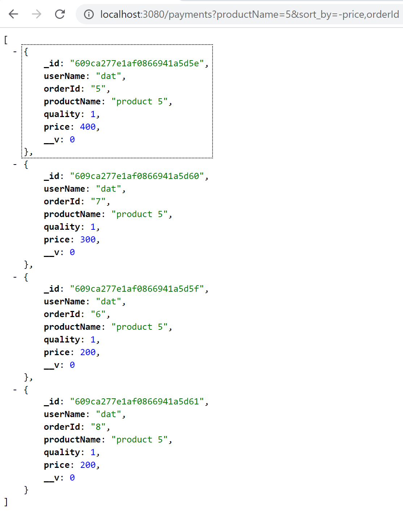

- Delete payments
```shell
curl -X DELETE --header "Content-Type: application/json" --header "Accept: application/json" -d @etc/checkout_delete.json "http://localhost:3080/payments" | jq .
```

<br/>
<div align="left">
    <b><a href="#top">⬆️ Back to Top</a></b>
</div>
<br/>

# 4. Run `Jest` test
- Make sure we start services `service-registry`, `search-service`, `product-service`, `checkout-service`, we can stop service `orchestrator-service` in this case. Also start MongoDB and Message MQ.
- We have 2 test suits in `tests/payments.test.js` and `tests/product.test.js`

```shell
# start all services before run jest test
cd orchestrator-service
run npm test
```
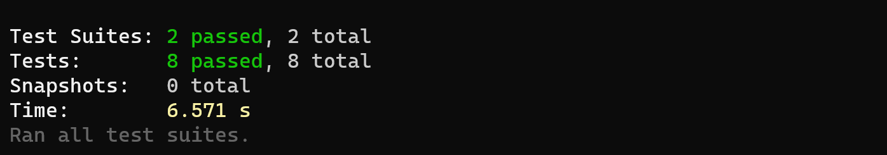

<br/>
<div align="left">
    <b><a href="#top">⬆️ Back to Top</a></b>
</div>
<br/>

# 5. Source structure
## 5.1. Run eslint in every service folder
- In every service, type the following command line
```shell
npm run lint
npm run lint:fix
```

## 5.2. Structure
- Most of service have a similar structure, it includes `src` and `tests` folder.
- Currently we only focus testing on `orchestrator-service`, a full flow from orchestrator-service to backend and database.

<center>
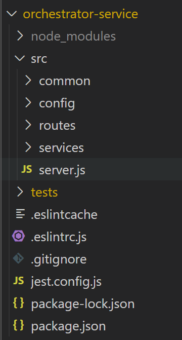
</center>

## 5.3. Library Usage
- `axios`: A promise based HTTP clien
- `bunyan`: A JSON logging library for node.js services
- `mongoose`: A MongoDB ODM
- `amqplib`: Library for message broker, RabbitMQ
- `http-errors`: Create HTTP error objects
- `semver`: The semantic version parser.

## 5.4. Database
- To simplify the persistent we just have 2 tables (collections) in MongoDB, `Product` and `Payment`.
- These collections dynamiclly created by using ORM mongoose once run services.
- Currently, most of backend services are using ORM persistence including `search-service`, `checkout-service`, `product-service`
- Here are schemes

```javascript
const productSchema = new mongoose.Schema({
	name: String,
	price: Number,
	branch: String,
	color: String
});

const paymentSchema = new mongoose.Schema({
	userName: String,
	orderId: Number,
	productName: String,
	quality: Number,
	price: Number
});
```
<br/>
<div align="left">
    <b><a href="#top">⬆️ Back to Top</a></b>
</div>
<br/>

# 6. Sequence diagram in some use cases

- **Search and sort products with some condition**
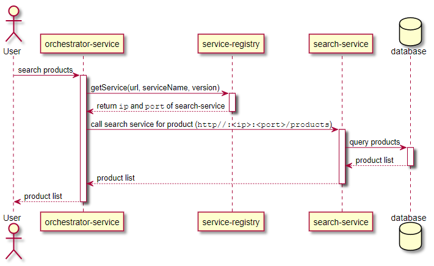

</p>

- **Post checkout data into Message RabbitMQ**
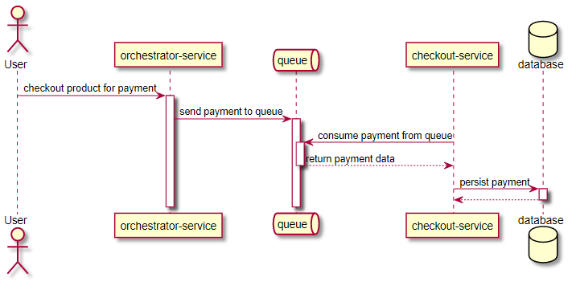

<br/>
<div align="left">
    <b><a href="#top">⬆️ Back to Top</a></b>
</div>
<br/>
