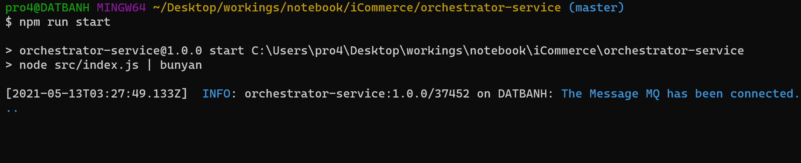

# Overview Architect


# Local setup
## Start MongoDB docker-compose
```shell
cd etc/mongo-docker/
# Create and start containers
docker-compose up -d --build

# Display services
docker-compose ps

# Stop services
sudo docker-compose stop

# Start services
docker-compose start

# Stop and remove containers, networks, images, and volumes
docker-compose down -v
```


- Use Robo 3T to accesss MongoDB with defaut db name and account
```json
db.createUser(
{
	user: "admin",
	pwd: "admin",
	roles: [
		{
			role: "readWrite",
			db: "my-mongo-db"
		}
	]
}
)
```


## Start RabbitMQ docker
```shell
docker run -it --rm --name rabbitmq -p 5672:5672 -p 15672:15672 rabbitmq:3-management
```


## Start service-registry
```shell
cd service-registry
npm run start
```


## Start search-service
```shell
cd search-service
npm run start
```


## Start product-service
```shell
cd product-service
npm run start
```


## Start checkout-service
```shell
cd checkout-service
npm run start
```


## Start orchestrator-service
```shell
cd orchestrator-service
npm run start
```




# CURL command for REST API
- Insert products into `Product` table
```shell
curl -X POST --header "Content-Type: application/json" --header "Accept: application/json" -d @etc/product_insert.json "http://localhost:3080/products"
```

  - List all products
```shell
curl -X GET --header 'Accept: application/json' 'http://localhost:3080/products'
```


- Search products by name
```shell
curl -X GET --header 'Accept: application/json' 'http://localhost:3080/products?name=name1&sort_by=name'
```


- Search products by name with operator
```shell
curl -X GET --header 'Accept: application/json' 'http://localhost:3080/products?name=eq:name1'
```


- Search products by name with operator and sort by price on ascending order
```shell
curl -X GET --header 'Accept: application/json' 'http://localhost:3080/products?price=gt:1&sort_by=-price'
```


- Delete products
```shell
curl -X DELETE --header "Content-Type: application/json" --header "Accept: application/json" -d @etc/product_delete.json "http://localhost:3080/products"
```

- Send data checkout to Message MQ, data will be populated and upserted into `Payments` table
```shell
curl -X POST --header "Content-Type: application/json" --header "Accept: application/json" -d @etc/checkout_send.json "http://localhost:3080/checkout"
```


- Search all payments
```shell
curl -X GET --header 'Accept: application/json' 'http://localhost:3080/payments'
```


- Search payments by product name
```shell
curl -X GET --header 'Accept: application/json' 'http://localhost:3080/payments?productName=eq:product%203'
```


- Search payments by product name and sort price on ascending order
```shell
curl -X GET --header 'Accept: application/json' 'http://localhost:3080/payments?productName=5&sort_by=-price,orderId'
```


- Delete payments
```shell
curl -X DELETE --header "Content-Type: application/json" --header "Accept: application/json" -d @etc/checkout_delete.json "http://localhost:3080/payments"
```
